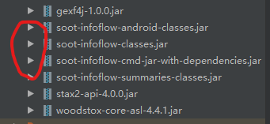

## 打个先手
引入下面的jar包(没圈的包是用来生成可视化的调用图的)
  
## 怎么解析？
代码很简单:
  1:给个apk文件的路径。
  2:实例化 ```ProcessManifest```
  3：getPerissions()：获取APP开发过程中使用到的权限
  4：targetSdkVersion：获取targetSdkVersion
```
/**解析AndroidManift.xml*/
public void analysisManifest(String apkPath) throws IOException, XmlPullParserException
{
    //实例化processManifest
    ProcessManifest proManifest = new ProcessManifest(apkPath);
    //获取targetSdkVersion
    System.out.println(proManifest.targetSdkVersion());
    //获取应用在Manifest文件中声明的权限（也包括库声明的，最后一起打包了）
    System.out.println(proManifest.getPermissions());
}
```

## diao用？
先看图

  

获取到的权限：
  - 这里获取到的权限没有区分是否为危险权限，但是此处的权限可以有助于获取应用自身的API-Permission Mapping

targetSdkVersion
  - 重要性不言而喻

## processManifest源码解析
表面意思是处理Manifest的，就是Android最后打包出来的整体配置文件内容。
先给个示例apk最后打包好的AndroidManifest

- processManfest.targetSdkVersion
```
public int targetSdkVersion() {
    List<AXmlNode> usesSdk = this.manifest.getChildrenWithTag("uses-sdk");
    //获取uses-sdk标签
    if (usesSdk != null && !usesSdk.isEmpty()) {
        AXmlAttribute<?> attr = ((AXmlNode)usesSdk.get(0)).getAttribute("targetSdkVersion");
        //获取targetSDKVersion标签内容
        if (attr == null) {
            return -1;
        } else {
            return attr.getValue() instanceof Integer ? (Integer)attr.getValue() : Integer.parseInt("" + attr.getValue());
        }
    } else {
        return -1;
    }
}
```
- processManfest.getPermissions
```
public Set<String> getPermissions() {
    List<AXmlNode> usesPerms = this.manifest.getChildrenWithTag("uses-permission");
    Set<String> permissions = new HashSet();
    Iterator var3 = usesPerms.iterator();

    while(true) {
        while(var3.hasNext()) {
            AXmlNode perm = (AXmlNode)var3.next();
            AXmlAttribute<?> attr = perm.getAttribute("name");
            if (attr != null) {
                permissions.add((String)attr.getValue());
            } else {
                Iterator var6 = perm.getAttributes().values().iterator();

                while(var6.hasNext()) {
                    AXmlAttribute<?> a = (AXmlAttribute)var6.next();
                    if (a.getType() == 3 && a.getName().isEmpty()) {
                        permissions.add((String)a.getValue());
                    }
                }
            }
        }

        return permissions;
    }
}
```
