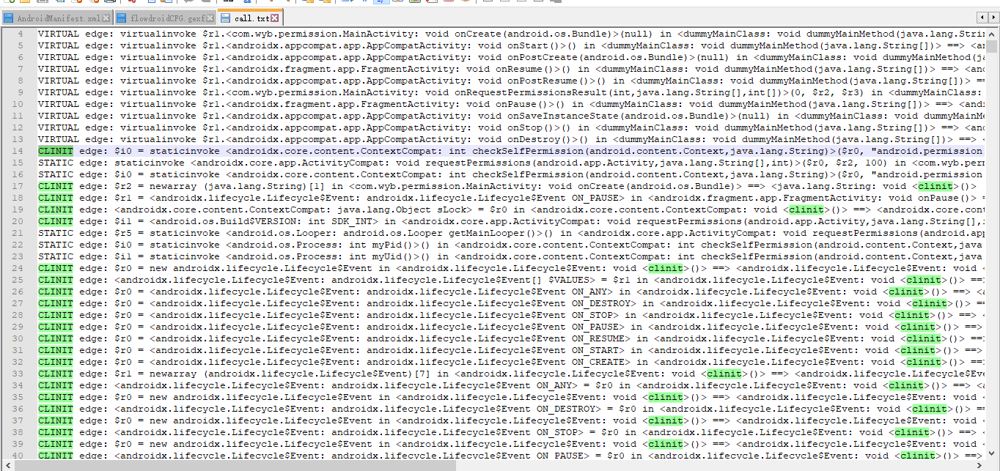

## 简单的Demo
- 仅仅提取出调用图
```
/**生成函数调用图*/
public void generateCallGraph(String androidJarPath ,String apkPath )
{

    SetupApplication setupApplication = new SetupApplication(androidJarPath,apkPath);// 提供android.jar和apk的存放路径
    soot.G.reset();//reset

    setupApplication.setCallbackFile(Main.class.getResource("AndroidCallbacks.txt").getFile()); //提供一个txt文件，貌似没卵用


    setupApplication.constructCallgraph(); //开始构建调用图

    CallGraph callGraph = Scene.v().getCallGraph(); //获取，也可以把callGraph保存到文件里面
    System.out.println(callGraph);
}
```
保存好之后就是下面这种：



## 如何可视化？
- Step1:
```
public static void main(String[] args)
   {
       SetupApplication app = new SetupApplication(jarPath, apk);
       soot.G.reset();
       //传入AndroidCallbacks.txt文件
       app.setCallbackFile(Generator.class.getResource("AndroidCallbacks.txt").getFile());
       app.constructCallgraph();

       //SootMethod获取函数调用图
       SootMethod entryPoint = app.getDummyMainMethod();
       CallGraph cg = Scene.v().getCallGraph();
       saveAsFileWriter(cg.toString(),"D:\\call.txt");
       System.out.println(cg);
       //可视化
      visit(cg,entryPoint);
       //导出函数调用图
      cge.exportMIG("flowdroidCFG", "D:/");
   }
   //可视化函数调用图的函数
    private static void visit(CallGraph cg,SootMethod m){
        //在soot中，函数的signature就是由该函数的类名，函数名，参数类型，以及返回值类型组成的字符串
        String identifier = m.getSignature();
        //记录是否已经处理过该点
        visited.put(identifier, true);
        //以函数的signature为label在图中添加该节点
        cge.createNode(identifier);
        //获取调用该函数的函数
        Iterator<MethodOrMethodContext> ptargets = new Targets(cg.edgesInto(m));
        if(ptargets != null){
            while(ptargets.hasNext())
            {
                SootMethod p = (SootMethod) ptargets.next();
                if(p == null){
                    System.out.println("p is null");
                }
                if(!visited.containsKey(p.getSignature())){
                    visit(cg,p);
                }
            }
        }
        //获取该函数调用的函数
        Iterator<MethodOrMethodContext> ctargets = new Targets(cg.edgesOutOf(m));
        if(ctargets != null){
            while(ctargets.hasNext())
            {
                SootMethod c = (SootMethod) ctargets.next();
                if(c == null){
                    System.out.println("c is null");
                }
                //将被调用的函数加入图中
                cge.createNode(c.getSignature());
                //添加一条指向该被调函数的边
                cge.linkNodeByID(identifier, c.getSignature());
                if(!visited.containsKey(c.getSignature())){
                    //递归
                    visit(cg,c);
                }
            }
        }
    }


  private static void saveAsFileWriter(String content,String filePath) {
      FileWriter fwriter = null;
      try {
          // true表示不覆盖原来的内容，而是加到文件的后面。若要覆盖原来的内容，直接省略这个参数就好
          fwriter = new FileWriter(filePath, true);
          fwriter.write(content);
      } catch (IOException ex) {
          ex.printStackTrace();
      } finally {
          try {
              fwriter.flush();
              fwriter.close();
          } catch (IOException ex) {
              ex.printStackTrace();
          }
      }
  }
```
- Step2:
```

import it.uniroma1.dis.wsngroup.gexf4j.core.EdgeType;
import it.uniroma1.dis.wsngroup.gexf4j.core.Gexf;
import it.uniroma1.dis.wsngroup.gexf4j.core.Graph;
import it.uniroma1.dis.wsngroup.gexf4j.core.Mode;
import it.uniroma1.dis.wsngroup.gexf4j.core.Node;
import it.uniroma1.dis.wsngroup.gexf4j.core.data.Attribute;
import it.uniroma1.dis.wsngroup.gexf4j.core.data.AttributeClass;
import it.uniroma1.dis.wsngroup.gexf4j.core.data.AttributeList;
import it.uniroma1.dis.wsngroup.gexf4j.core.data.AttributeType;
import it.uniroma1.dis.wsngroup.gexf4j.core.impl.GexfImpl;
import it.uniroma1.dis.wsngroup.gexf4j.core.impl.StaxGraphWriter;
import it.uniroma1.dis.wsngroup.gexf4j.core.impl.data.AttributeListImpl;

import java.io.File;
import java.io.FileWriter;
import java.io.IOException;
import java.io.Writer;
import java.util.List;
public class CGExporter {
    private Gexf gexf;
    private Graph graph;
    private Attribute codeArray;
    private AttributeList attrList;

    public CGExporter() {
        this.gexf = new GexfImpl();
        this.graph = this.gexf.getGraph();
        this.gexf.getMetadata().setCreator("wwww").setDescription("App method invoke graph");
        this.gexf.setVisualization(true);
        this.graph.setDefaultEdgeType(EdgeType.DIRECTED).setMode(Mode.STATIC);
        this.attrList = new AttributeListImpl(AttributeClass.NODE);
        this.graph.getAttributeLists().add(attrList);
        //可以给每个节点设置一些属性，这里设置的属性名是 codeArray，实际上后面没用到
        this.codeArray = this.attrList.createAttribute("0", AttributeType.STRING,"codeArray");
    }

    public void exportMIG(String graphName, String storeDir) {
        String outPath = storeDir + "/" + graphName + ".gexf";
        StaxGraphWriter graphWriter = new StaxGraphWriter();
        File f = new File(outPath);
        Writer out;
        try {
            out = new FileWriter(f, false);
            graphWriter.writeToStream(this.gexf, out, "UTF-8");
        } catch (IOException e) {
            e.printStackTrace();
        }
    }

    public Node getNodeByID(String Id) {
        List<Node> nodes = this.graph.getNodes();
        Node nodeFinded = null;
        for (Node node : nodes) {
            String nodeID = node.getId();
            if (nodeID.equals(Id)) {
                nodeFinded = node;
                break;
            }
        }
        return nodeFinded;
    }

    public void linkNodeByID(String sourceID, String targetID) {
        Node sourceNode = this.getNodeByID(sourceID);
        Node targetNode = this.getNodeByID(targetID);
        if (sourceNode.equals(targetNode)) {
            return;
        }
        if (!sourceNode.hasEdgeTo(targetID)) {
            String edgeID = sourceID + "-->" + targetID;
            sourceNode.connectTo(edgeID, "", EdgeType.DIRECTED, targetNode);
        }
    }

    public void createNode(String m) {
        String id = m;
        String codes = "";
        if (getNodeByID(id) != null) {
            return;
        }
        Node node = this.graph.createNode(id);
        node.setLabel(id).getAttributeValues().addValue(this.codeArray, codes);
        node.setSize(20);
    }

}
```
