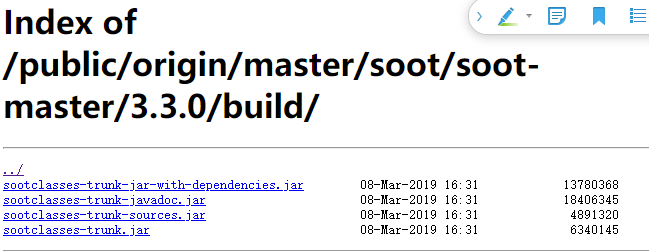
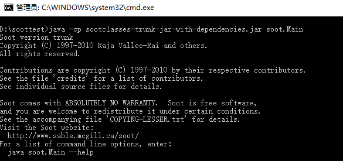
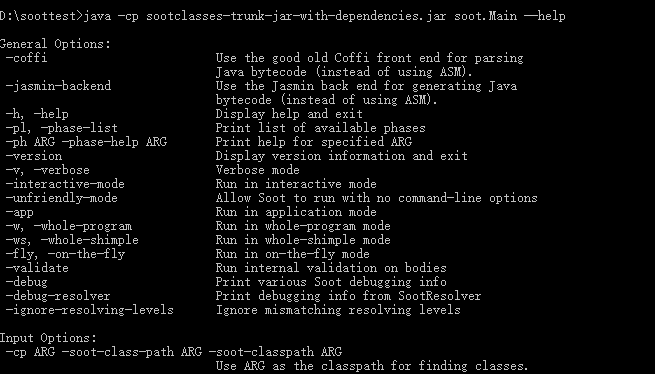
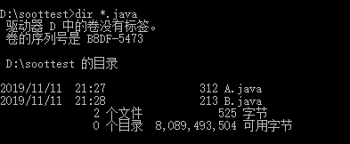
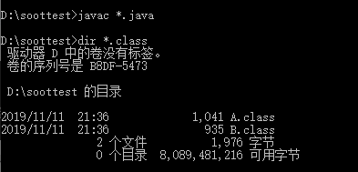

## 获取 Soot
- [点我](https://soot-build.cs.uni-paderborn.de/public/origin/master/soot/soot-master/)下载最新版本
- 在"Build"文件夹下有许多选项，通常来说，下面这一个就足够了。
  - sootclasses-trunk-jar-with-dependencies.jar
  - 
### 测试是否可用
- 在 sootclasses-trunk-jar-with-dependencies.jar 所在的文件夹打开命令行，输入```java -cp sootclasses-trunk-jar-with-dependencies.jar soot.Main```,出现下图，即成功
  - 
- 小插曲
  - 1：此前电脑中安装了两个sdk，1.7和12，1.7过老运行上述命令是出现了
  ```
  Exception in thread "main" java.lang.UnsupportedClassVersionError: soot/Main
  ```
  - 解决方案是不用1.7，配置12
  - 2：然后配置12过程也有小插曲，由下面的博客得到了解决
    - [1](https://blog.csdn.net/Iifuleyou/article/details/89527711)
    - [2](https://blog.csdn.net/u011973609/article/details/51116310/)
## 每夜版（nightly build 即每日构建）
- [相关解释](https://github.com/Sable/soot/wiki/Introduction:-Soot-as-a-command-line-tool#bleeding-edge-version-nightly-build)
- [点这下载](https://sable.github.io/soot/)
- 我理解的每夜版就是直接从Github库中构建的，，就像魔趣系统的每夜版和稳定版的区别一样，目前先使用稳定版，以后有需求了再更新这一块
## Soot的命令行
- 输出下面这个命令查看相关的快捷命令
  ```
  java -cp sootclasses-trunk-jar-with-dependencies.jar soot.Main --help
  ```
  - 
- 更详细的命令行选项[点这里](https://github.com/Sable/soot/wiki/Tutorials)查看（推荐的方式）
## 处理单个文件
- Soot一般都是处理一堆类文件，这些类文件可以采用下面三种格式之一：
  - 1：Java source code
  - 2: Java bytecode [关于字节码](https://www.jianshu.com/p/247e2475fc3a)
  - 3:Jimple source  [关于Jimple](https://blog.csdn.net/TheSnowBoy_2/article/details/52832838)
- 官方防止我不了解Jimple，还稍微解释了一下：
  - 1：Jimple是Soot中主要的中间代码的表现形式( primary intermediate representation),一个三地址代码，基本上是一种简化的Java代码，只需要15种不同的语句即可
  - 2：可以使用Soot将.java或者.class文件转化为.jimple文件或者转换回来
  - 3：更骚的是，你可以使用Soot从.java文件转化为.jimple文件，接着使用文本编辑器修改.jimple文件，最后将修改后的.jimple文件转化为.class文件，这样就手动优化程序了。听起来美滋滋(逃~
- 现在新建两个.java文件，就在上面jar包所在的文件夹下
  - 
- 查看文件
  - 
  - 注意：win:dir ; linux:ls
- 使用Soot处理类文件A和B的基本方式就是将它们添加到命令行，这使得它们成为应用类(application classes)
- 如果你使用的是JDK8(含不含以上？)，这些JAVA文件需要先编译，在它们作为命令行参数传递之前
  - 
  - emmm，我这里是没问题的，wiki上面显示的是会有问题，原因是Soot 有自己的classpath

## Soot自己的classpath
Soot有自己的classpath，并且只会从该路径上的JAR文件或目录中加载文件。<br>
默认的，此路径是空的，因此wiki[上面的例子](Soot has it’s own classpath and will load files only from JAR files or directories on that path)会出现*does not “see” the classes A and B*,那么下一步，就使用当前的目录"."即可
```
$ java -cp sootclasses-trunk-jar-with-dependencies.jar soot.Main -cp . A B
Soot started on Tue Feb 20 05:54:48 CET 2018
soot.SootResolver$SootClassNotFoundException: couldn't find class: java.lang.Object (is your soot-class-path set properly?)
```
又出现上面这个问题是为什么？可以看出Soot是找不到```java.lang.Object```
为什么Soot如此care```java.lang.Object```?为了对程序做有意义的事情，Soot需要具有类型信息，尤其是它需要为[局部变量重建类型](http://www.sable.mcgill.ca/publications/papers/#sas2000)，并且为此，它需要知道要处理的类的完整类型层次结构。<br>
了解了上面为什么需要 ```java.lang.Object```,选有三种方式去解决它
  - 1:添加 ```rt.jar```到classpath
  - 2:添加```-pp```选项，给```CLASSPATH```变量正确设置```rt.jar```和```JAVA_HOME```
  - 3：(不推荐)使用```-aalow-phantom-refs```选项
  - 猜测：我没出现问题是不是1：Soot版本的提升；2：我使用的JDK是12；3：我设置了classpath环境变量...后面出现相关问题了，再琢磨这三个做法(逃
<br>
第一个选项，添加JDK中的```rt.jar```到Soot的classpath(不是JVM的classpath).这个JAR文件里面包含了```java.lang.Object```
```
$ java -cp sootclasses-trunk-jar-with-dependencies.jar soot.Main -cp .:/home/user/ebodde/bin/jre1.8.0_161/lib/rt.jar A B
Soot started on Tue Feb 20 06:11:59 CET 2018
Transforming B...
Transforming A...
Writing to sootOutput\B.class
Writing to sootOutput\A.class
Soot finished on Tue Feb 20 06:12:01 CET 2018
Soot has run for 0 min. 1 sec.
```
<br>
通过上面的输出，貌似是ok的，Soot成功的将两个.java文件处理了，并产生了两个.class文件，输出到sootOutput文件夹下。值得注意：通常，Soot将处理您在命令行上命名的所有类以及这些类引用的所有类。
<br>
再看下面这个常见的错误：
```
$ java -cp sootclasses-trunk-jar-with-dependencies.jar soot.Main -cp .:~/bin/sun-jdk1.6.0_05/jre/lib/rt.jar A B
Soot started on Tue Feb 20 05:59:48 CET 2018
Exception in thread "main" java.lang.RuntimeException: couldn't find class: java.lang.Object (is your soot-class-path set properly?)
```
这又是为啥？
What went wrong? Well, you tried to use ~ because that points to your home directory, no? Well yes, but the problem is that usually ~ is expanded by the shell, but not in this case. Soot gets the raw ~ string as a command line option and currently Soot is unable to expand that string into the right string for your home directory. So always use full or relative paths in Soot’s classpat
