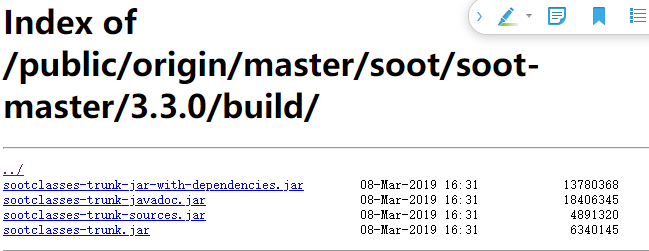
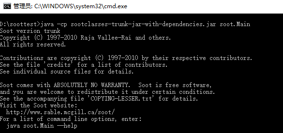
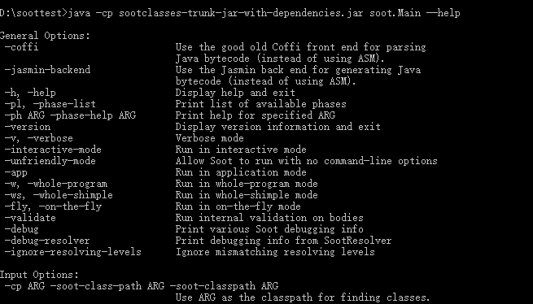
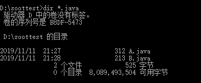
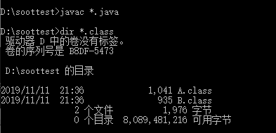

# 综述

  

## 获取 Soot
- [点我](https://soot-build.cs.uni-paderborn.de/public/origin/master/soot/soot-master/)下载最新版本
- 在"Build"文件夹下有许多选项，通常来说，下面这一个就足够了。
  - sootclasses-trunk-jar-with-dependencies.jar
  - 
### 测试是否可用
- 在 sootclasses-trunk-jar-with-dependencies.jar 所在的文件夹打开命令行，输入```java -cp sootclasses-trunk-jar-with-dependencies.jar soot.Main```,出现下图，即成功
  - 
- 小插曲
  - 1：此前电脑中安装了两个sdk，1.7和12，1.7过老运行上述命令是出现了
  ```
  Exception in thread "main" java.lang.UnsupportedClassVersionError: soot/Main
  ```
  - 解决方案是不用1.7，配置12
  - 2：然后配置12过程也有小插曲，由下面的博客得到了解决
    - [1](https://blog.csdn.net/Iifuleyou/article/details/89527711)
    - [2](https://blog.csdn.net/u011973609/article/details/51116310/)
## 每夜版（nightly build 即每日构建）
- [相关解释](https://github.com/Sable/soot/wiki/Introduction:-Soot-as-a-command-line-tool#bleeding-edge-version-nightly-build)
- [点这下载](https://sable.github.io/soot/)
- 我理解的每夜版就是直接从Github库中构建的，，就像魔趣系统的每夜版和稳定版的区别一样，目前先使用稳定版，以后有需求了再更新这一块
## Soot的命令行
- 输出下面这个命令查看相关的快捷命令
  ```
  java -cp sootclasses-trunk-jar-with-dependencies.jar soot.Main --help
  ```
  - 
- 更详细的命令行选项[点这里](https://github.com/Sable/soot/wiki/Tutorials)查看（推荐的方式）
## 处理单个文件
- Soot一般都是处理一堆类文件，这些类文件可以采用下面三种格式之一：
  - 1：Java source code
  - 2: Java bytecode [关于字节码](https://www.jianshu.com/p/247e2475fc3a)
  - 3:Jimple source  [关于Jimple](https://blog.csdn.net/TheSnowBoy_2/article/details/52832838)
- 官方猜到我不了解Jimple，还稍微解释了一下：
  - 1：Jimple是Soot中主要的中间代码的表现形式( primary intermediate representation),一个三地址代码，基本上是一种简化的Java代码，只需要15种不同的语句即可
  - 2：可以使用Soot将.java或者.class文件转化为.jimple文件或者转换回来
  - 3：更骚的是，你可以使用Soot从.java文件转化为.jimple文件，接着使用文本编辑器修改.jimple文件，最后将修改后的.jimple文件转化为.class文件，这样就手动优化程序了。听起来美滋滋(逃~
- 现在新建两个.java文件，就在上面jar包所在的文件夹下
  - 
- 查看文件
  - 
  - 注意：win:dir ; linux:ls
- 使用Soot处理类文件A和B的基本方式就是将它们添加到命令行，这使得它们成为应用类(application classes)
- 如果你使用的是JDK8(含不含以上？)，这些JAVA文件需要先编译，在它们作为命令行参数传递之前
  - 
  - emmm，我这里是没问题的，wiki上面显示的是会有问题，原因是Soot 有自己的classpath

## Soot自己的classpath
- Soot有自己的classpath，并且只会从该路径上的JAR文件或目录中加载文件。<br>
- 默认的，此路径是空的，因此wiki[上面的例子](https://github.com/Sable/soot/wiki/Introduction:-Soot-as-a-command-line-tool#soots-classpath)会出现*does not “see” the classes A and B*,那么下一步，就使用当前的目录"."即可
  ```
  $ java -cp sootclasses-trunk-jar-with-dependencies.jar soot.Main -cp . A B
  Soot started on Tue Feb 20 05:54:48 CET 2018
  soot.SootResolver$SootClassNotFoundException: couldn't find class: java.lang.Object (is your soot-class-path set properly?)
  ```
- 出现上面这个问题是为什么？
  - 可以看出Soot是找不到```java.lang.Object```
- 为什么Soot如此care```java.lang.Object```?
  - 为了对程序做有意义的事情，Soot需要具有类型信息，尤其是它需要为[局部变量重建类型](http://www.sable.mcgill.ca/publications/papers/#sas2000)，并且为此，它需要知道要处理的类的完整类型层次结构。<br>
- 了解了上面为什么需要 ```java.lang.Object```,选有三种方式去解决它
  - 1:添加 ```rt.jar```到classpath
  - 2:添加```-pp```选项，给```CLASSPATH```变量正确设置```rt.jar```和```JAVA_HOME```
  - 3：(不推荐)使用```-aalow-phantom-refs```选项
  - 猜测：我没出现问题是不是1：Soot版本的提升；2：我使用的JDK是12；3：我设置了classpath环境变量...后面出现相关问题了，再琢磨这三个做法(逃
### 1：第一个解决方案
- 第一个选项，添加JDK中的```rt.jar```到Soot的classpath(不是JVM的classpath).这个JAR文件里面包含了```java.lang.Object```。
  ```
  $ java -cp sootclasses-trunk-jar-with-dependencies.jar soot.Main -cp .:/home/user/ebodde/bin/jre1.8.0_161/lib/rt.jar A B
  Soot started on Tue Feb 20 06:11:59 CET 2018
  Transforming B...
  Transforming A...
  Writing to sootOutput\B.class
  Writing to sootOutput\A.class
  Soot finished on Tue Feb 20 06:12:01 CET 2018
  Soot has run for 0 min. 1 sec.
  ```
- 通过上面的输出，貌似是ok的，Soot成功的将两个.java文件处理了，并产生了两个.class文件，输出到sootOutput文件夹下。值得注意：通常，Soot将处理您在命令行上命名的所有类以及这些类引用的所有类。
- 再看下面这个常见的错误：
  ```
  $ java -cp sootclasses-trunk-jar-with-dependencies.jar soot.Main -cp .:~/bin/sun-jdk1.6.0_05/jre/lib/rt.jar A B
  Soot started on Tue Feb 20 05:59:48 CET 2018
  Exception in thread "main" java.lang.RuntimeException: couldn't find class: java.lang.Object (is your soot-class-path set properly?)
  ```
- 这又是为啥？当你使用```~```的时候，```~```表达的含义是它代表你的主文件目录。但问题是 ```~```通常由shell扩展，在这种情况下不扩展。( but the problem is that usually ~ is expanded by the shell, but not in this case. )Soot将```~```字符串作为命令行选项获取，目前Soot无法将该字符串扩展为适合你的主目录的字符串。**所以需要在Soot的classpath中使用完整或相对路径**

### 2：第二个解决方案
- 第二个选项是使用```-pp```
  ```
  $ java -cp sootclasses-trunk-jar-with-dependencies.jar soot.Main -cp . -pp A B
  Soot started on Tue Feb 20 06:13:51 CET 2018
  Transforming A...
  Transforming B...
  Writing to sootOutput\A.class
  Writing to sootOutput\B.class
  Soot finished on Tue Feb 20 06:13:52 CET 2018
  Soot has run for 0 min. 1 sec.
  ```
- 这个操作相比之前要添加classpath容易的多，当然，这正是使用此操作的原因。```-pp```代表"前置路径"，这意味着Soot自动将以下内容添加到自己的类路径里面
  - 1：当前```CLASSPATH```变量的内容
  - 2：```${JAVA_HOME}/lib/rt.jar```
  - 3:如果使用了全程序模式(即启用了-w选项，以后还会有更多的功能)，那么它还会添加```${JAVA_HOME}/lib/jce.jar```
### 3： 第三个解决方案
- ```–allow-phantom-refs```
```
$ java -cp sootclasses-trunk-jar-with-dependencies.jar soot.Main -allow-phantom-refs -cp . A B
Soot started on Tue Feb 20 06:15:39 CET 2018
Transforming Transforming A...
B...
Writing to sootOutput\B.class
Writing to sootOutput\A.class
Soot finished on Tue Feb 20 06:15:40 CET 2018
Soot has run for 0 min. 0 sec.
```
- 上述操作做了什么？
  - 上述操作告诉Soot：我tm不想给你你现在没有的类(可能因为你没有这些类)但是你必须尽全力实现我要求的操作，即使没有这些类。
  - Soot为每一个无法解析的类都创建了一个"phantom class"，并告诉你相关情况。
  - 注意：这个方法非常有限，并且在许多情况下都无法获得所想要的结果，建议仅当自己知道自己在做什么的时候才使用这个选项。
- Windows用户注意事项：
  - Soot会正确处理驱动器号，在Windows中，路径分隔符必须为反斜杠，而不是正斜杠。 路径分隔符应为“;” （分号）代替“：”（冒号）。
## 处理整个目录
- 可以使用Soot中的```-process-dir```处理整个目录或者JAR文件
  ```
  java -cp sootclasses-trunk-jar-with-dependencies.jar soot.Main -cp . -pp -process-dir .
  Soot started on Fri Feb 23 18:09:59 CET 2018
  Transforming B...
  Transforming A...
  Writing to sootOutput\B.class
  Writing to sootOutput\A.class
  Soot finished on Fri Feb 23 18:10:00 CET 2018
  Soot has run for 0 min. 1 sec.
  ```
- 处理JAR文件的时候，只需要执行同样的操作但是不提供目录，提供JAR的路径就可以。但是：如果再次将相同的命令应用于相同的文件夹，则现在会遇到问题：
  ```
  $ java -cp sootclasses-trunk-jar-with-dependencies.jar soot.Main -cp . -pp -process-dir .
  Soot started on Fri Feb 23 18:22:21 CET 2018
  java.lang.RuntimeException: Class names not equal! A != sootOutput.A
  ```
- 又怎么回事？
  - 像之前所说的，Soot会将产生的class文件放置到sootOutput文件夹下，这个文件夹位于当前目录"."中。因此，Soot现在处理了先前生成的文件，同时抱怨名称为“ A”的类已经存在./sootOutput/A的事实，因此实际上应该具有名称sootOutput.A，即位于sootOutput包中。
- 所以，当时用```-process-dir```操作的同时也使用```-d```去重定向Soot的输出：
  ```
  $ java -cp sootclasses-trunk-jar-with-dependencies.jar soot.Main -cp . -pp -process-dir . -d /tmp/sootout
  Soot started on Fri Feb 23 18:15:55 CET 2018
  Transforming B...
  Transforming A...
  Writing to \tmp\sootout\A.class
  Writing to \tmp\sootout\B.class
  Soot finished on Fri Feb 23 18:15:56 CET 2018
  Soot has run for 0 min. 1 sec.
  ```
- 这样会将Soot的输出重定向到/ tmp / sootout，这不是当前目录的子目录。
## 处理某些类型的文件(.class / .java / .jimple)
- 假设现在有一个同时包含A.java和A.class的目录，并且像以前一样调用Soot。 在这种情况下，Soot将从文件A.class加载A的定义。 这可能并不总是你所想要的。 ```–src-prec```选项告诉Soot它应该优先选择哪种输入类型。 有四个选项：
  - 1:```c```或```class```（默认值）：倾向于使用class文件作为Soot源.
  - 2:```only-class```：仅将class文件用作Soot源.
  - 3:```J```或```jimple```：Jimple文件作为Soot源
  - 4：```Java```：Java文件作为Soot源。
- 所以上面的例子中,```-src-prec java```将会加载```A.java```
## 应用程序类 VS 库类
- Soot实际处理的类称为**应用程序类**。 这与**库类**相反，库类不进行处理，而是仅用于类型解析。 应用程序类通常是在命令行上明确声明的那些类，或位于通过```–process-dir```引用的目录中的那些类。

- 但是，当使用``-app``选项时，Soot也会处理这些类引用的所有类。 但是，它将不会处理JDK中的任何类，即```java.*``` 和```com.sun.*``` 包之一中的类。
- 如果你也希望包含这些内容，则必须使用特殊的```-i```选项，例如 ```-i Java```。
- 有关此选项和其他命令行选项，请参见[命令行选项指南](https://github.com/Sable/soot/wiki/Tutorials)。
