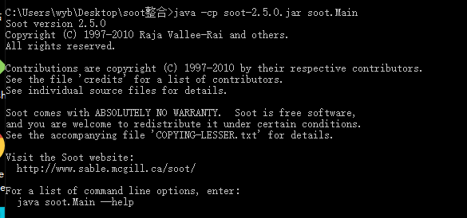
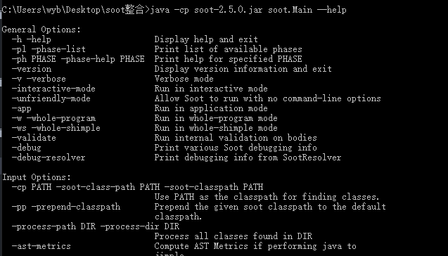

## soot下载
- 地址：
  - https://soot-build.cs.uni-paderborn.de/public/origin/master/soot/soot-master/
- 不过我没有选择此下载地址里面的，我下载的是soot-2.5.0,jar
  - https://www.sable.mcgill.ca/soot/index.html
### 简单测试
- java -cp soot-2.5.0.jar soot.Main
  - 
## soot的命令行
- 查看命令行：java -cp soot-2.5.0.jar soot.Main --help
  - 
- 可以参考pdf文档里面的OPTIONS
  - https://soot-build.cs.uni-paderborn.de/public/origin/develop/soot/soot-develop/options/soot_options.htm#options

## 处理单个文件
- soot通常可以处理很多类，这些类可以采取以下三种格式之一：
  - Java源代码，即.java文件
  - Java字节码，即.class文件
  - Jimple源，即.jimple文件
- 简单介绍一下Jimple，Jimple是Soot的中间代表，是一个三地址代码，基本上是一种Java的简化版本，只需要大约15种不同的语句。 可以使用soot将.java文件和.class文件转换为.jimple文件。 甚至可以使用soot从.java生成.jimple文件，再使用普通文本编辑器进行编辑，再讲.jimple文件转换为.class文件。几乎是手动优化
