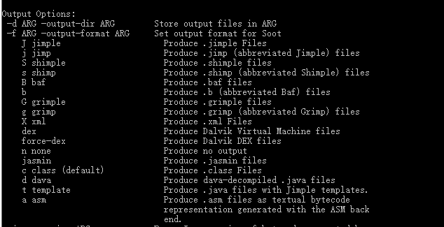
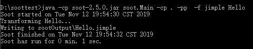
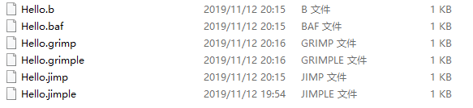
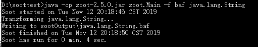

# 综述
  - 1：设置Soot
  - 2：Soot的可能性
  - 3：生成Jimple文件
  - 4：为java.lang.String生成 jimple,baf,grimp
  - 5：输出.jimple或者.java文件
  - 注意：2019年11月12日，第一次提交，此时使用的是soot-2.5.0以及JDK 1.7.因为使用JDK 1.7和新版本的soot有问题；使用JDK 12又没有rt.jar
## 设置Soot
前提是你已经可以运行soot了。[相关解释](https://github.com/Sable/soot/wiki/Introduction:-Soot-as-a-command-line-tool)
## Soot的可能性
Soot有两个基本的用户：可以独立的运行为命令行工具或者是Java编译器框架。

作为命令行工具，Soot可以：
  - 反汇编类文件
  - 汇编类文件
  - 优化类文件

作为Java编译器框架，Soot可以用作开发新优化的测试平台。 然后，可以将这些新的优化添加到命令行Soot工具调用的优化基础集。 可以添加的优化可以应用于单个类文件，也可以应用于整个应用程序。

Soot通过能够以各种不同形式处理类文件来完成这些无数(myriad)任务。 目前，Soot接受来自以下来源的代码：
  - 1:Java（字节码和Java 7之前的源代码），包括编译成Java字节码的其他语言，例如 Scala
  - 2:Android字节码
  - 3:Jimple中间表示
  - 4:Jasmin，低级别的中间表示。

并输出其任何中间表示。 通过使用```--help```选项调用Soot，可以看到输出格式：
```
java -cp sootclasses-trunk-jar-with-dependencies.jar soot.Main --help
...
Output Options:
-d DIR -output-dir DIR      Store output files in DIR
-f FORMAT -output-format FORMAT
                            Set output format for Soot
J jimple                    Produce .jimple Files
j jimp                      Produce .jimp (abbreviated Jimple) files
S shimple                   Produce .shimple files
s shimp                     Produce .shimp (abbreviated Shimple) files
B baf                       Produce .baf files
b                           Produce .b (abbreviated Baf) files
G grimple                   Produce .grimple files
g grimp                     Produce .grimp (abbreviated Grimp) files
X xml                       Produce .xml Files
dex                         Produce Dalvik Virtual Machine files
force-dex                   Produce Dalvik DEX files
n none                      Produce no output
jasmin                      Produce .jasmin files
c class (default)           Produce .class Files
d dava                      Produce dava-decompiled .java files
t template                  Produce .java files with Jimple templates.
...
```

  

Soot中目前使用六个中间表示形式：baf，jimple，shimple，grimp，jasmin和classfile。每种形式的简要说明如下：
  - 1:```baf```简化的字节码表示形式。用于检查Java字节码作为堆栈代码，但格式更好。具有两种文本表示形式（一种缩写（.b文件），一种完整（.baf文件）。）

  - 2：```jimple```类型的3地址代码。用于执行优化和检查字节码的非常方便的表示形式。有两个文本表示形式（.jimp文件和.jimple文件。）

  - 3:```shimple```jimple的SSA变体。具有两个文本表示形式（.shimp文件和.shimple文件。）

  - 4：```grimp```聚集（相对于表达式树）的jimp。检查反汇编代码的最佳中间表示形式。有两个文本表示形式（.grimp文件和.grimple文件。）

  - 5:```jasmin```是一种凌乱的汇编格式。主要用于调试Soot。 Jasmin文件以“ .jasmin”结尾。

  - 6:```classfiles```原始Java字节码格式。二进制（非文本）表示形式。常用的.class文件。

## 生成Jimple文件
使用下面这个简单的类代码完成测试
```
public class Hello
{
    public static void main(String[] args)
    {
        System.out.println("Hello world!");
    }
}
```
先对上面的类进行编译```javac Hello.java```,在Hello.class所在的目录中使用下面这个命令
```
java soot.Main -cp CLASSPATH -f jimple Hello

java -cp soot-2.5.0.jar soot.Main -cp . -pp  -f jimple Hello
```
如下图：

  

生成的 Hello.jimple 应该包括：
```
public class Hello extends java.lang.Object
{

    public void <init>()
    {
        Hello r0;

        r0 := @this: Hello;
        specialinvoke r0.<java.lang.Object: void <init>()>();
        return;
    }

    public static void main(java.lang.String[])
    {
        java.lang.String[] r0;
        java.io.PrintStream $r1;

        r0 := @parameter0: java.lang.String[];
        $r1 = <java.lang.System: java.io.PrintStream out>;
        virtualinvoke $r1.<java.io.PrintStream: void println(java.lang.String)>("Hello world!");
        return;
    }
}

```
## 为java.lang.String生成 jimple,baf,grimp
通过上面的测试，可以对指定的文件继续生成 .b,.baf,.jimo,.jimple,.grimp和.grimple文件
```

D:\soottest>java -cp soot-2.5.0.jar soot.Main -cp . -pp  -f baf Hello
Soot started on Tue Nov 12 20:15:21 CST 2019
Transforming Hello...
Writing to sootOutput\Hello.baf
Soot finished on Tue Nov 12 20:15:22 CST 2019
Soot has run for 0 min. 1 sec.

D:\soottest>java -cp soot-2.5.0.jar soot.Main -cp . -pp  -f b Hello
Soot started on Tue Nov 12 20:15:38 CST 2019
Transforming Hello...
Writing to sootOutput\Hello.b
Soot finished on Tue Nov 12 20:15:40 CST 2019
Soot has run for 0 min. 1 sec.

D:\soottest>java -cp soot-2.5.0.jar soot.Main -cp . -pp  -f jimp Hello
Soot started on Tue Nov 12 20:15:47 CST 2019
Transforming Hello...
Writing to sootOutput\Hello.jimp
Soot finished on Tue Nov 12 20:15:49 CST 2019
Soot has run for 0 min. 1 sec.

D:\soottest>java -cp soot-2.5.0.jar soot.Main -cp . -pp  -f grimp Hello
Soot started on Tue Nov 12 20:15:58 CST 2019
Transforming Hello...
Writing to sootOutput\Hello.grimp
Soot finished on Tue Nov 12 20:16:00 CST 2019
Soot has run for 0 min. 1 sec.

D:\soottest>java -cp soot-2.5.0.jar soot.Main -cp . -pp  -f grimple Hello
Soot started on Tue Nov 12 20:16:03 CST 2019
Transforming Hello...
Writing to sootOutput\Hello.grimple
Soot finished on Tue Nov 12 20:16:05 CST 2019
Soot has run for 0 min. 1 sec.
```

  

下面对JDK库进行一个测试
```
java -cp soot-2.5.0.jar soot.Main -f baf java.lang.String
```

  

具体文件详情如下：
```
.....
public static java.lang.String copyValueOf(char[], int, int)
{
    word r0, i0, i1;

    r0 := @parameter0: char[];
    i0 := @parameter1: int;
    i1 := @parameter2: int;
    new java.lang.String;
    dup1.r;
    load.r r0;
    load.i i0;
    load.i i1;
    specialinvoke <java.lang.String: void <init>(char[],int,int)>;
    return.r;
}
.....
```
## 输出```.jimple```或者```.java```文件
Soot不仅可以生成```.class```文件，还可以生成```.jimple```和```.java```文件以及其他文件。 可以使用–f选项选择输出格式。 如果使用```–f dava```来反编译为Java，请确保文件```<jre> /lib/jce.jar```位于Soot的classpath中。
