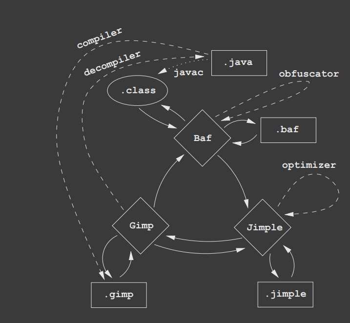
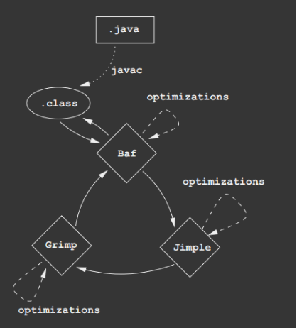

## 总述
- Jimple是一种中间代码
### Jimple的设计目的
- 简化分析，简化向Java字节码的过渡
### 不同中间代码的转换图
- 先上图，再解释
  - 
#### Java相关
- 编译和反编译
- .java 通过javac转化为 .class
- 并不只有一种编译方式，比如可以编译为.gimp
#### 与Soot中间代码相关
- soot擅长的中间代码
  - Baf
  - Gimp
  - Jimple（√）
- Soot最擅长处理Jimple，所以通过Jimple中间代码的形式来让Soot进行处理
- Gimp
  - 通过Java的编译方式转换为Gimp，接下来就进入Soot的世界
- Baf
  - 通过.class也可以进行转换，也进图Soot来管了。
- 任何一种中间代码形式都可以进行输出
- .java或者.class文件，经过转化后，变为soot可以处理的形式，接着读者就可以在soot中进行分析和优化了
  - 

## 特点
- 有类型的
- 三地址的
- 基于语句的
### 有类型的
- 在java中是有类型的，当我们定义一个变量的时候，是需要声明其类型的。
  - 要注意在js里面，运行的时候才确定类型
```
int i
```
- 将上面的代码转换之后，类型保留
### 三地址
- java代码
  ```
  int i,j;
  i = 2;
  j = 2*i + 8;
  ```
- Jimple中间代码
```
int i, j, temp$0, temp$1, temp$2, temp$3;

        temp$0 = 2;

        i = temp$0;

        temp$1 = 2 * i;

        temp$2 = temp$1;

        temp$3 = temp$2 + 8;

        j = temp$3;
```
- 拆的很细致
- 赋值需要借助于临时变量
- 3地址，这一特点使得java代码中很多高级的特性，被分解成很多细小的单位。
- 一般而言，三地址代码将包含大部分低级操作，即目标机所支持的指令。
- 关于中间代码
  - http://www.doc88.com/p-303734535593.html

### 基于语句的
