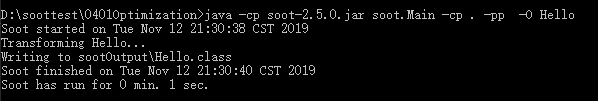
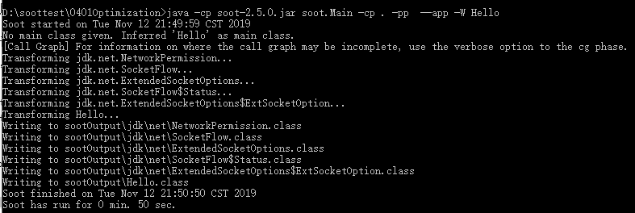
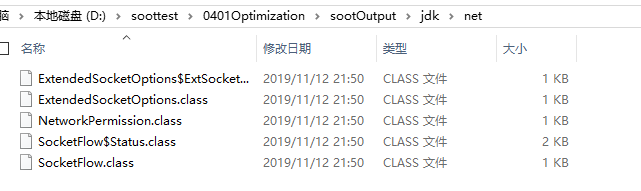
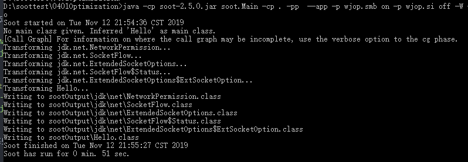

# 综述
简述了Soot作为优化器工具。了解下面的知识点之后，可以使用Soot对类文件和整个应用程序进行优化。

前提要求是要安装好Soot。

  - 1：类文件优化
  - 2：程序优化

## 类文件优化
Soot有能力去优化单个的类文件。可以在单个类文件上执行的一些转换包括：通用子表达式消除，部分冗余消除，副本传播，常数传播和折叠，条件分支折叠，无效分配消除，不可达代码消除，无条件分支折叠以及未使用的局部消除。

优化上一节中Hello的例子，使用下面这个命令
```
官网：java soot.Main -O Hello
Transforming Hello...

本人：java -cp soot-2.5.0.jar soot.Main -cp . -pp  -O Hello
Soot started on Tue Nov 12 21:30:38 CST 2019
Transforming Hello...
Writing to sootOutput\Hello.class
```

  

然后，Soot将在sootOutput目录中留下一个经过改进的新Hello.class文件。 对于上面这个例子，Soot后的改善不是那么明显。 但是，Soot的确消除了未使用的本地物体。 尝试将未使用的本地添加到Hello并给出以下命令：
```
官网：java soot.Main -O -f jimple Hello
Transforming Hello...

本人：java -cp soot-2.5.0.jar soot.Main -cp . -pp  -O -f jimple Hello
Soot started on Tue Nov 12 21:34:03 CST 2019
Transforming Hello...
Writing to sootOutput\Hello.jimple
Soot finished on Tue Nov 12 21:34:05 CST 2019
```
应该可以看到没有使用的本地变量不再出现。(我没对比)

在这种模式下，可以将任意数量的类文件指定给Soot，只要它们在```CLASSPATH```中即可。

**注意**，类文件可能属于某个软件包。 例如，它可能被称为```your.package.Foo```。这表明Foo类属于```your.package.```。它将位于```your / package /```子目录中。 为了对此文件进行Sootify，您必须位于```your / package /```的父目录中，并且必须指定```java soot.Main -O your.package.Foo```

## 程序优化
Soot提供了```--app```选项开关，以使其可用于应用程序中的所有类文件。 如果使用此功能，则用户指定主类文件，然后Soot将加载所有需要的类。

Soot具有全程序模式（通过```-W```选项激活），在该模式下，它可以执行全程序转换。 例如，方法内联要求整个程序正确解析虚拟方法调用。

要指定Soot应该执行整个程序优化（-W）以及单类优化，请使用以下命令：
```
官网：java soot.Main --app -W Hello
Transforming Hello...

实际：java -cp soot-2.5.0.jar soot.Main -cp . -pp  --app -W Hello
Soot started on Tue Nov 12 21:49:59 CST 2019
No main class given. Inferred 'Hello' as main class.
```
wdnmd,执行这条命令运行了好长时间：
  - 
  - 
执行上述命令，Soot会写出除了在java. javax. 和sun.* 中的所有类文件

-W的默认行为是静态内联方法(statically inline methods)。

Soot还可以通过静态方法绑定来使用:
```
官网：java soot.Main --app -p wjop.smb on -p wjop.si off -W -O Hello

我：java -cp soot-2.5.0.jar soot.Main -cp . -pp  --app -p wjop.smb on -p wjop.si off -W -O Hello
```
这种类型的优化在某些基准上已产生了明显的加速。

   
