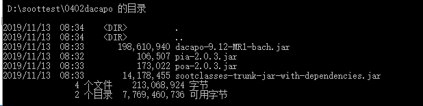
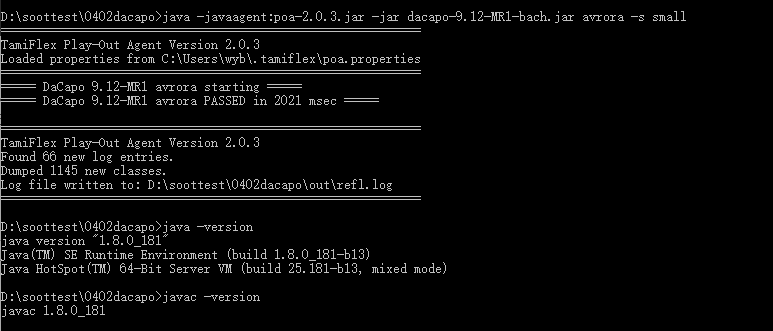
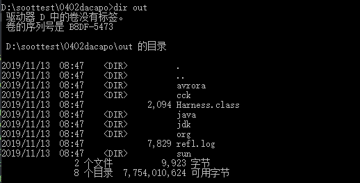

# 综述
基于Soot和temiflex对Dacapo数据集进行静态分析.
在本文中，将说明如何使用TamiFlex，它是一种在运行时跟踪Java程序的反射调用的工具。 然后，借助此信息，TamiFlex可以转换原始程序，以便将反射调用替换为常规Java调用。

  - 1：下载必要的组件
  - 2：转储类并创建日志文件
  - 3：运行Soot
  - 4：使用转换后的类文件运行DaCapo

## 下载必要的组件
DaCapo是具有实际Java应用程序的基准套件。 要使用Soot分析DaCapo基准测试，请首先下载以下内容：
  - 1：[DaCapo JAR file](http://sourceforge.net/projects/dacapobench/files/)
  - 2: TamiFlex: [poa.jar](https://github.com/secure-software-engineering/tamiflex/releases/download/V2.0.3/poa-2.0.3.jar), and [pia.jar](https://github.com/secure-software-engineering/tamiflex/releases/download/V2.0.3/pia-2.0.3.jar),静态转换DaCapo的代码然后测量在代码中的动态代码
  - 3：[sootclasses-trunk-jar-with-dependencies.jar](https://soot-build.cs.uni-paderborn.de/public/origin/master/soot/soot-master/) for Soot 3.0.1
```
上面要求的Soot是3.0.1，我先用2.5.0试一下，不行再试3.0.1和JDK 1.7，再不行再试3.0.1和1.8
```
下载完成之后，设置大概如下：
```
$ls -1
dacapo-9.12-bach.jar
pia-x.y.z.jar
poa-x.y.z.jar
sootclasses-trunk-jar-with-dependencies.jar

D:\soottest\0402dacapo 的目录

2019/11/13  08:34    <DIR>          .
2019/11/13  08:34    <DIR>          ..
2019/11/13  08:33       198,610,940 dacapo-9.12-MR1-bach.jar
2019/11/13  08:32           106,507 pia-2.0.3.jar
2019/11/13  08:33           173,022 poa-2.0.3.jar
2019/11/13  08:33        14,178,455 sootclasses-trunk-jar-with-dependencies.jar
```

  

## 转储类并创建日志文件
接下来，我们使用Play-Out Agent为每个DaCapo基准配置转储JVM在执行此配置时加载的所有类文件以及包含有关反射调用信息的反射跟踪文件。

让我们首先考虑在dacapo上，在avrora-small（基准套件的一个程序）上的单个运行。 通常，我们仅通过声明```java -jar dacapo-9.12-bach.jar avrora -s small```来运行avrora。 要激活Play-Out Agent，我们改为使用以下命令：
```
java -javaagent:poa-x.y.z.jar -jar dacapo-9.12-MR1-bach.jar avrora -s small
===== DaCapo unknown avrora starting =====
===== DaCapo unknown avrora PASSED in 5065 msec =====
=============================================
TamiFlex Play-Out Agent Version 2.0.3
Found 66 new log entries.
```
此处运行时候有一个小问题，可以看问题记录，解决方案是升级JDK 1.7到 JDk 1.8

  

`-javaagent：poa-x.y.z.jar` 部分指示VM使用Play-Out Agent。 请注意附加输出```Found 66 new log entries.```。代理报告说它为反射日志文件找到了66个新条目。

你可以根据需要检查日志文件（和转储的类文件）：
```
官网：$ ls out
avrora  cck  Harness.class  java  org  refl.log  sun
$ head out/refl.log
Class.getDeclaredField;<java.lang.invoke.MethodHandle: java.lang.invoke.LambdaForm form>;java.lang.invoke.MethodHandle.<clinit>;;isAccessible=false;
Class.getDeclaredField;<java.util.concurrent.atomic.AtomicBoolean: int value>;java.util.concurrent.atomic.AtomicBoolean.<clinit>;;isAccessible=false;
Class.getDeclaredMethod;<org.dacapo.harness.TestHarness: void main(java.lang.String[])>;Harness.main;;isAccessible=false;
...

本人：
emmm Windows下怎么使用linux的head命令呀
```

  

默认情况下，代理将其日志文件和类文件转储到out目录中。 可以使用[ConfigurationFile](https://code.google.com/p/tamiflex/wiki/ConfigurationFile)修改目录。

注意：Play-Out Agent需要额外的堆空间。 因此，建议使用```-Xmx```标志为JVM提供额外的空间。

为了方便起见，我们提供了一个[脚本](http://tamiflex.googlecode.com/hg/dacapo-scripts/dump-all)，可让您转储所有dacapo基准测试和所有输入大小的类文件和反射跟踪。 （你还将需要[设置脚本](http://tamiflex.googlecode.com/hg/dacapo-scripts/settings)。）这些脚本仅适用于小于2.0的TamiFlex版本。 在本教程中，我们仅分析该套件的程序avrora。
## 运行Soot
接下来，我们要使用Soot分析（并可能转换）转储的类文件，并根据反射跟踪文件中的信息构造一个调用图。

要将Soot应用于avrora-small，我们可以使用以下命令：
```
java -Xmx10G -cp sootclasses-trunk-jar-with-dependencies.jar soot.Main -w -app -p cg.spark enabled -cp JAVA_HOME/lib/rt.jar:JAVA_HOME/lib/jce.jar:out:dacapo-9.12-MR1-bach.jar -include org.apache. -include org.w3c. -main-class Harness -d sootified/avrora-small Harness
```
emmm,我一直没有运行成功，感觉出问题的点还是在classpath

```
Soot started on Sat Feb 24 12:48:35 CET 2018
[Call Graph] For information on where the call graph may be incomplete, use the verbose option to the cg phase.
[Spark] Pointer Assignment Graph in 1.4 seconds.
[Spark] Type masks in 0.1 seconds.
[Spark] Pointer Graph simplified in 0.0 seconds.
[Spark] Propagation in 34.0 seconds.
[Spark] Solution found in 34.0 seconds.
Transforming jdk.internal.util.xml.BasicXmlPropertiesProvider...
Transforming Harness...
Transforming jdk.internal.util.xml.PropertiesDefaultHandler...
...
Writing to sootified/avrora/org/w3c/dom/Document.class
Writing to sootified/avrora/org/w3c/dom/Element.class
Writing to sootified/avrora/org/w3c/dom/Node.class
...
Soot finished on Sat Feb 24 12:49:21 CET 2018
Soot has run for 0 min. 46 sec.
```
参数```-include org.apache. -include org.w3c.```对于avrora并不是真正必要的，但我们建议通常将它们用于DaCapo。 问题是，默认情况下，Soot不会分析以下软件包中的任何类：
  - ```Java.```
  - ```sun.```
  - ```javax.```
  - ```com.sun.```
  - ```com.ibm.```
  - ...
但是有些DaCapo基准测试，例如 batik大部分由```org.apache```中的类组成。 因此，我们必须明确指示Soot包括这些软件包。

运行Soot之后，您将在磁盘上找到转换后的类文件：
```
$ ls sootified/avrora-small/
jdk  Harness.class
```
（在默认模式下，Soot实际上没有对给定的类应用任何转换，但是我们当然可以在此时启用某些整个程序的优化。）

同样，为方便起见，我们提供了一个[脚本](http://tamiflex.googlecode.com/hg/dacapo-scripts/process-all)来处理Soot的所有DaCapo基准测试。 （您还将需要[设置脚本](http://tamiflex.googlecode.com/hg/dacapo-scripts/settings)。）
## 使用转换后的类文件运行DaCapo
接下来，我们使用Play-In Agent来运行带有转换后的类文件的DaCapo。 首先，修改pia.properties [ConfigurationFile](https://code.google.com/p/tamiflex/wiki/ConfigurationFile)，以使```inDir```指向```sootified / avrora-small```。 然后提交这些命令：
```
java -javaagent:pia-x.y.z.jar -jar dacapo-9.12-MR1-bach.jar avrora -s small
```
```
===== DaCapo unknown avrora starting =====
===== DaCapo unknown avrora PASSED in 2779 msec =====

=======================================================
TamiFlex Play-In Agent Version 2.0.3
Replaced 623 out of 1143 classes.
=======================================================
```
代理报告说，已用从目录中获取的类替换了Y个已加载类中的X个。 （请注意，有些类可能无法替换，因为默认情况下，Soot不会转换或输出```java.lang.* ```等中的类。有关详细信息，请参见我们对```-include```标志的评论。） 该代理使VM从```sootified / avrora-small```（而不是```dacapo-9.12-bach.jar```）加载avrora的类文件。
