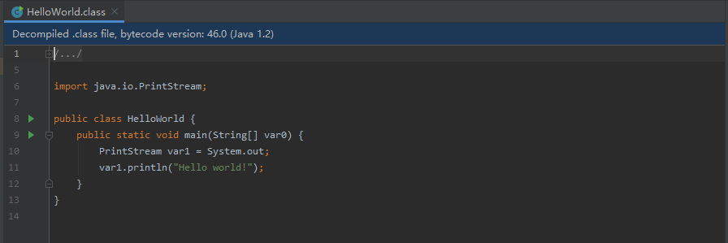

# 综述
创建一个类，在类中创建方法。
下列的步骤就是描述如何创建一个类文件(class file)的。

## 加载```java.lang.Object```和库类
*Load``` java.lang.Object```, the root of the Java class hierarchy.*

在扩展Soot框架的时候，此步骤不是必要的。因为在拓展Soot框架的时候情况下，当用户代码被调用的时候加载类文件已经完成了。
```
Scene.v().loadClassAndSupport("java.lang.Object");
```
这行代码使Soot加载java.lang.Object类并创建```java.lang.Object```相应的```SootClass```对象以及```SootMethods```和```SootFields```。 当然，```java.lang.Object```也会引用其他对象。 调用```loadClassAndSupport```将加载指定类的可传递闭包(the transitive closure)，以便加载```java.lang.Object```所需的其他所有类型都将被加载。（也就是说被加载类的指定类所引用的类也会被加载）

此过程称为 **解析**（resolution）。

由于我们的HelloWorld程序将使用标准库中的类，因此我们还必须添加下面这一行代码：
```
Scene.v().loadClassAndSupport("java.lang.System");
也就是加载 java.lang.System
```
上面代码引用```Scene.v（）```。 ```Scene```是程序中所有```SootClasses```的容器,它包含了程序里所有的SootClass，并提供各种实用的方法。 对于一个单例Scene对象(singleton Scene object)，可通过调用```Scene.v（）```进行访问。

**注意**：Soot可以从类文件或```.jimple```输入文件中加载这些类。 使用前者时，也就是从类文件中加载类的时候，Soot将加载每个类文件的常量池中引用的所有类名(load all class names referred to in the constant pool of each class file)。 从```.jimple```加载将使Soot仅加载所需的类型。

## 创建一个新的```SootClass```对象
*创建`HelloWorld`SootClass,并且设置它的 super class 为"java.lang.Object"*
```
SootClass sClass = new SootClass("HelloWorld", Modifier.PUBLIC);
```
上面代码创建了一个名为```HelloWorld```的public的```SootClass```对象

```
sClass.setSuperclass(Scene.v().getSootClass("java.lang.Object"));
```
这会将新创建的类的superclass设置为java.lang.Object对应的```SootClass```对象（注：Soot里使用SootClass代表Java中的类）。 注意在```Scene```里```getSootClass```的使用方法。

```
Scene.v().addClass(sClass);
```
将新创建的```HelloWorld```类添加到```Scene```中，所有的类一旦他们被创建都应该属于```Scene```

## 向```SootClass```中添加方法
给 HelloWorld 创建一个 ```main()```方法，此方法有一个空的方法体(empty body)。
现在我们有一个```SootClass```,下一步把方法添加进去。


```
SootMethod method = new SootMethod("main",                 
    Arrays.asList(new Type[] {ArrayType.v(RefType.v("java.lang.String"), 1)}),
    VoidType.v(), Modifier.PUBLIC | Modifier.STATIC);
```
创建一个新的public static 方法main(访问类型是public static)，同时声明它接受java.lang.String对象的数组（也就是接收的参数类型是数组类型），并返回void。

SootMethod的构造函数需要一个list，因此我们调用Java方法```Arrays.asList```从使用new Type[]动态生成的只含一个元素的数组中创建一个list。 在列表中，我们放置了一个数组类型，它对应于```java.lang.String```对象的一维ArrayType。 通过调用```RefType```将获取与```java.lang.String```类相对应的类型。

（也就是SootMethod()里面的参数有：方法名，参数类型，访问类型
其中的参数类型可以再指定传入的参数）

**Type：** 每个```SootClass```代表一个Java对象。 给定一个具有给定类型的对象，我们可以实例化该类。
类型和类这两个概念紧密相关，但又截然不同。
通过名称获取```java.lang.String```类的类型，我们调用```RefType.v（“ java.lang.String”）```。
给定一个SootClass对象```sc```，我们也可以调用```sc.getType（）```来获取相应的类型。
```
sClass.addMethod(method);//将方法添加到类中
```

## 向方法中添加代码
在main方法中添加一些代码。 为此，必须为代码选择一个中间表示形式。

### 创建JimpleBody
在Soot中，我们将```Body```附加到SootMethod上，目的是将一些代码与该方法相关联。
每个```Body```都知道它对应于哪个```SootMethod```，而且一个```SootMethod```一次仅只能有一个活动的```Body```（可通过SootMethod.getActiveBody（）访问）。
各种中间表示提供了不同类型的```Body```；
Soot有```JimpleBody```，```ShimpleBody```，```BafBody```和````GrimpBody````。

更精确地说，```Body```具有三个重要特征：chains of ```Local```s,```Trap```s和```Unit```s。（Local链、Trap链和Unit链）
一个```Chain```（链）是一种类似于列表的结构，能够时间复杂度为O（1）方式去插入和删除元素。  ```Locals```是在body内的局部变量（Jimple里面会把每个方法需要用到的变量在方法体的最开始全部定义好）。 ```Trap```表明哪些```Unit```捕获了哪些异常。 ```Unit```本身是语句。

注意，```Unit```是表示语句（如Jimple）和指令（如Baf）的术语。

为```main```创建一个 *Jimple Body*，向body中添加locals和instructions（局部变量和指令）。
```
JimpleBody body = Jimple.v().newBody(method);
method.setActiveBody(body);
```
上面代码创建了与之前方法相关的```JimpleBody```，并且将其设置为相应方法的active body。（我理解的就是创建了一个与上面method相关的body）

### Adding a Local
局部变量
```
Local arg = Jimple.v().newLocal("l0", ArrayType.v(RefType.v("java.lang.String"), 1));
body.getLocals().add(arg)
```
创建一个新的Jimple里的 ```Local```并将其添加到```Body```
### Adding a Unit
```
units.add(Jimple.v().newIdentityStmt(arg,
      Jimple.v().newParameterRef(ArrayType.v
        (RefType.v("java.lang.String"), 1), 0)));
```

SootMethod 声明它具有参数，但这些参数未绑定到```Body```的```Local```s。 ```IdentityStmt```执行此操作,即将声明的参数绑定到```Body```的```Local```s； 它将第一个参数的值分配给arg，arg的类型为String数组。

```
// insert "tmpRef.println("Hello world!")"
{
    SootMethod toCall = Scene.v().getMethod
      ("<java.io.PrintStream: void println(java.lang.String)>");
    units.add(Jimple.v().newInvokeStmt
        (Jimple.v().newVirtualInvokeExpr
           (tmpRef, toCall.makeRef(), StringConstant.v("Hello world!"))));
}
```
得到带有签名的方法：
```
<java.io.PrintStream:void println(java.lang.String)>
方法名为：println
属于：PrintStream
返回值：void
参数：String
```
调用此方法时候传入的值为常量"Hello world!"

### 写入类文件
将程序写为 .class文件最完美的方法是使用ASM后端，下面是示例代码：
```
int java_version = Options.v().java_version();
String fileName = SourceLocator.v().getFileNameFor(sClass, Options.output_format_class);
OutputStream streamOut = new FileOutputStream(fileName);
BafASMBackend backend = new BafASMBackend(sClass, java_version);
backend.generateClassFile(streamOut);
streamOut.close();
```
也可以使用过时的Jasmin后端。方法必须由Jimple转换成Jasmin，然后再组装成字节码。组装字节码的操作通过JasminOutputStream实现。
我们首先构造出一个输出流，它将会使用Jasmin源，并且输出.class文件的输出流。
我们可以手动指定文件名，也可以让Soot确定正确的文件名。 我们在这里让Soot指定文件名。
```
String fileName = SourceLocator.v().getFileNameFor(sClass, Options.output_format_class);
OutputStream streamOut = new JasminOutputStream(new FileOutputStream(fileName));
PrintWriter writerOut = new PrintWriter(new OutputStreamWriter(streamOut));
JasminClass jasminClass = new soot.jimple.JasminClass(sClass);
jasminClass.print(writerOut);
writerOut.flush();
streamOut.close();
```
如果我们希望输出jimple源代码而不是.class文件，则可以使用以下代码：
```
String fileName = SourceLocator.v().getFileNameFor(sClass, Options.output_format_jimple);
OutputStream streamOut = new FileOutputStream(fileName);
PrintWriter writerOut = new PrintWriter(new OutputStreamWriter(streamOut));
Printer.v().printTo(sClass, writerOut);
writerOut.flush();
streamOut.close();
```
我们省略了```JasminOutputStream```，并在```Printer```上调用```printTo```方法。

HelloWorld类创建对应的Jimple是：
```
public class HelloWorld extends java.lang.Object
{
   public static void main(java.lang.String[])
   {
       java.lang.String[] r0;
       java.io.PrintStream r1;

       r0 := @parameter0: java.lang.String[];
       r1 = <java.lang.System: java.io.PrintStream out>;
       virtualinvoke r1.<java.io.PrintStream: void println(java.lang.String)>("Hello world!");
       return;
   }
}
```

## 总结
- 11.16日
  上面代码主要做了什么?用soot做了一创建类和方法的操作，并且创建出来的东西可以输出写为.class文件或者soot 的中间表示形式

  
