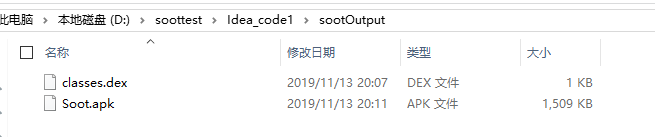
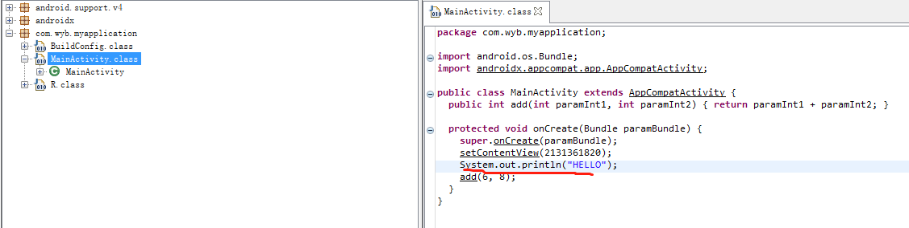

刚了解了Soot wiki中关于解析apk的部分，于是进行一个测试。
## 创建自己的apk
为了简单起见，apk内只有MainActivity，以及里面有onCreate()和add()
```
public class MainActivity extends AppCompatActivity {

    @Override
    protected void onCreate(Bundle savedInstanceState) {
        super.onCreate(savedInstanceState);
        setContentView(R.layout.activity_main);
        add(6,8);

    }
    public int add(int a,int b)
    {
        return a+b;
    }
}
```
接着对此apk Build出release的版本，记下此文件的位置，后续使用

  

## 其他资源
Soot
  ```
  sootclasses-trunk-jar-with-dependencies.jar
  ```

android
  我仅使用了android-25,因为刚好as里面有...

    

## 代码
```
import java.util.Collections;
import java.util.Iterator;
import java.util.Map;

import soot.Body;
import soot.BodyTransformer;
import soot.Local;
import soot.PackManager;
import soot.PatchingChain;
import soot.RefType;
import soot.Scene;
import soot.SootClass;
import soot.SootMethod;
import soot.Transform;
import soot.Unit;
import soot.jimple.*;
import soot.options.Options;


public class AndroidInstrument {

        public static void main(String[] args) {

            Options.v().set_allow_phantom_refs(true);
            Options.v().set_validate(true);


            /**output_format_dex表示输出文件的apk/dex，将输出在sootOutPut目录下*/
            Options.v().set_output_format(Options.output_format_dex);
            Options.v().set_process_dir(Collections.singletonList("D:\\soottest\\utils\\Soot.apk"));
            Options.v().set_force_android_jar("D:\\soottest\\utils\\android_25\\android.jar");

            /**设置处理文件的类型，src_prec_apk表示处理的是apk文件*/
            Options.v().set_src_prec(Options.src_prec_apk);
            /**设置Soot的soot-class*/
            Options.v().set_soot_classpath("D:\\soottest\\utils\\android_25\\android.jar;C:\\Program Files\\Java\\jdk1.8.0_181\\jre\\lib\\rt.jar;C:\\Program Files\\Java\\jdk1.8.0_181\\jre\\lib\\jce.jar;" +
                    "D:\\soottest\\utils\\sootclasses-trunk-jar-with-dependencies.jar");

            Scene.v().loadNecessaryClasses();
            // resolve the PrintStream and System soot-classes
            Scene.v().addBasicClass("java.io.PrintStream",SootClass.SIGNATURES);
            Scene.v().addBasicClass("java.lang.System",SootClass.SIGNATURES);

            PackManager.v().getPack("jtp").add(new Transform("jtp.myInstrumenter", new BodyTransformer() {

                @Override
                protected void internalTransform(final Body b, String phaseName, @SuppressWarnings("rawtypes") Map options) {
                    final PatchingChain<Unit> units = b.getUnits();

                    //important to use snapshotIterator here
                    for(Iterator<Unit> iter = units.snapshotIterator(); iter.hasNext();) {
                        final Unit u = iter.next();
                        u.apply(new AbstractStmtSwitch() {
                            //如果u是一个调用语句的时候，类似：staticinvoke <com.example.source_a.MainActivity: int add4(int,int)>($i0, $i1)
                            public void caseInvokeStmt(InvokeStmt stmt) {
                                //该调用语句中，如果被调用的方法是add时
                                InvokeExpr invokeExpr = stmt.getInvokeExpr();
                                if(invokeExpr.getMethod().getName().equals("add")) {

                                    Local tmpRef = addTmpRef(b);
                                    Local tmpString = addTmpString(b);
                                    //插入：tmpRef = <java.lang.System: java.io.PrintStream out>;类似于类的实例化
                                    //newAssignStmt()为赋值语句
                                    // insert "tmpRef = java.lang.System.out;"
                                    units.insertBefore(Jimple.v().newAssignStmt(
                                            tmpRef, Jimple.v().newStaticFieldRef(
                                                    Scene.v().getField("<java.lang.System: java.io.PrintStream out>").makeRef())), u);

                                    // insert "tmpLong = 'HELLO';"
                                    units.insertBefore(Jimple.v().newAssignStmt(tmpString,
                                            StringConstant.v("HELLO")), u);

                                    // insert "tmpRef.println(tmpString);"
                                    SootMethod toCall = Scene.v().getSootClass("java.io.PrintStream").getMethod("void println(java.lang.String)");
                                    units.insertBefore(Jimple.v().newInvokeStmt(
                                            Jimple.v().newVirtualInvokeExpr(tmpRef, toCall.makeRef(), tmpString)), u);

                                    //check that we did not mess up the Jimple
                                    b.validate();
                                }
                            }
                            //同样可以处理其他语句,如下面的赋值语句
                            public void caseAssignStmt(AssignStmt stmt){}
                            //这些都是class AbstraceStmtSwitch中可以查看

                        });
                    }
                }


            }));
            PackManager.v().runPacks();
            PackManager.v().writeOutput();
            soot.Main.main(args);
        }

        private static Local addTmpRef(Body body)
        {
            Local tmpRef = Jimple.v().newLocal("tmpRef", RefType.v("java.io.PrintStream"));
            body.getLocals().add(tmpRef);
            return tmpRef;
        }

        private static Local addTmpString(Body body)
        {
            Local tmpString = Jimple.v().newLocal("tmpString", RefType.v("java.lang.String"));
            body.getLocals().add(tmpString);
            return tmpString;
        }
}

```
## 结果分析

  

对生成的Soot.apk反编译，并查看代码如下

  

## 参考博客
https://blog.csdn.net/zlp1992/article/details/42463463
https://blog.csdn.net/u010308400/article/details/50437739
https://blog.csdn.net/LZQ729089549/article/details/51399219
