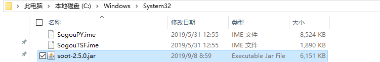

## 环境
- eclipse kepler
  - eclipse-java-kepler-SR2-win32-x86_64
- jdk 1.7
  - jdk-7u80-windows-x64.exe
- https://blog.csdn.net/weixin_38506641/article/details/77938826

## 命令行
### 下载
https://www.sable.mcgill.ca/soot/index.html
### 保存
- 保存到c:windows/system32
  - 
### 运行
- 在jar包所在文件夹下面运行
